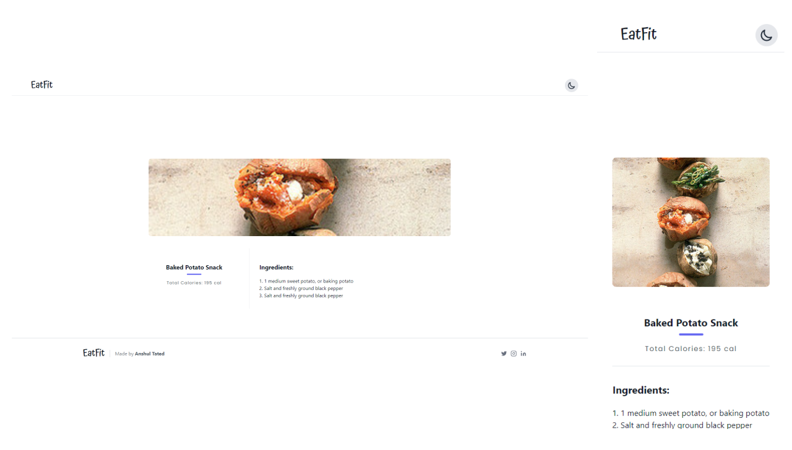

# EatFit

 &nbsp;&nbsp; 

## Contents

- [Technologies Used](#technologies-used)
- [Introduction](#introduction)
- [Home Page](#home-page)
  - [Home Page - Recipe Loaded](#home-page-recipe)
- [Recipe Card Page](#recipe-card-page)
- [Dark Mode](#dark-mode)

## Technologies Used 

| Name        | Description |
| ----------- | ---------------- |
| Next.js     | An open-source React front-end development web framework that enables functionality such as server-side rendering and generating static websites for React based web applications. |
| TailwindCSS | A utility-first CSS framework packed with classes that can be composed to build any design, directly in your markup. |
| Edamam API    | An API to provide recipe information from ingredients and much, much more.|

## Introduction 

This is a simple Recipe application created using Next.js which is a React Framework for production. Next.js has various features that make it the ideal choice for a website with great SEO (Search Engine Optimization) and performance. Static Site Generation is a feature that Next.js comes with and it is great for generating webpages which have static content.

## Home Page 

The HomePage displays an input field for the user to provide any ingredient they like to get the respective recipe. The website uses TailwindCSS for styling and each pokemon and its details are displayed in a card. Additionally, when the data is being loaded, skeleton cards are displayed as placeholders. This helps to improve the first-paint performance of the application.

### Home Page - Recipe Loaded 

When the user provides an ingredient, the website looks up for recipe for the respective ingredient by using the Edamam API and then displays 20 recipes for the ingredient.The website uses TailwindCSS for styling and each recipe and its details are displayed in a card. 

## Recipe Card Page 

This page displays a card which contains the image of the dish, the name of the recipe, total calories of the recipe and the ingredients required for preparing the respective recipe.

## Dark Mode 

TailwindCSS 2.0 includes features for implementing dark mode for applications and this has been used to make the entire application dark mode compatible. When the user taps on the dark mode toggle, all elements of the website transition from a light theme to a dark theme with a smooth transition animation. The screenshots of all pages in dark mode are provided below.

